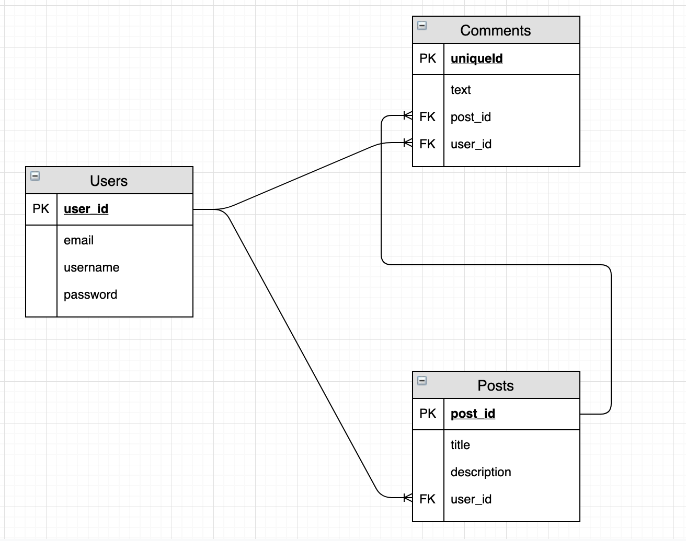
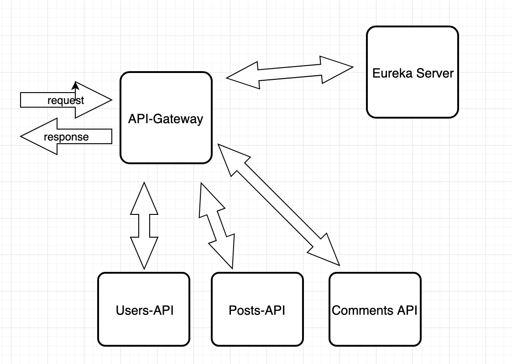

# Post-It Micro Services

###### Christopher Cook and Qin Zhu collaborated on building a micro services REST API resembling the app Reddit.com

## Technologies Used
* Spring
* Hibernate
* Junit & Integration Testing
* RabbitMQ - messaging queue
  * Post - Delete
  * Comment - Email to Post owner
* ELK stack - service logging
* Jacoco/Jenkins - Coverage reports
* Swagger/Postman - mapping and testing api routes
* User stories [Pivotal Tracker](https://www.pivotaltracker.com/n/projects/2416890)
* Draw.io for ERD diagram

## Approach & Planning
The app was planned and prepared using Pivotal Tracker for user stories and Draw.io for the ERD diagram. In order to create our micro services app we create five different apps using Spring Boot. We create an app for the API-Gateway that will be our entry point. A Eureka app to map the our services to resources. Our entities User, Post, Comment are three separate Spring Boot apps.

## ERD

## Architecture

## Microservice Repo's
* [Eureka](https://github.com/christopher-cook/eureka-api)
* [API-gateway](https://github.com/christopher-cook/api-gateway)
* [Users-API](https://github.com/christopher-cook/users-api)
* [Posts-API](https://github.com/christopher-cook/posts-api)
* [Comments-API](https://github.com/christopher-cook/comments-api)
* [Email-Server](https://github.com/zhu-qin/email-service)
